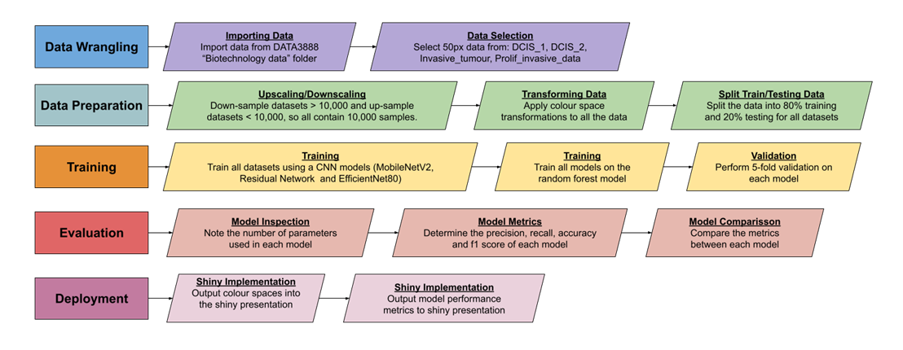
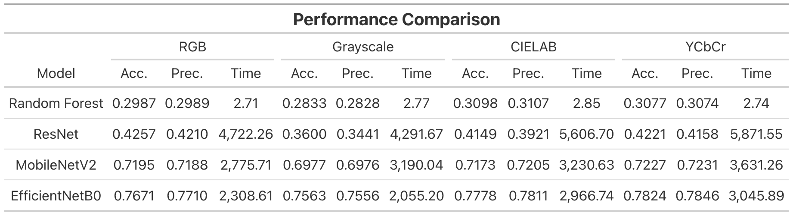
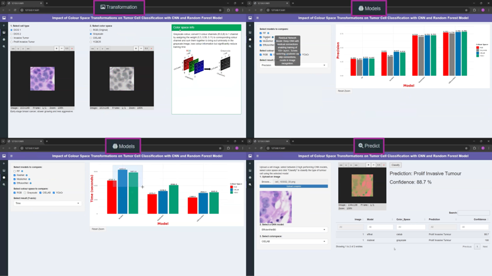

```{r echo=FALSE, message=FALSE, warning = FALSE }
# Required package
library(tidyverse)
library(gt)
library(readr)
library(dplyr)
library(tidyr)
library(webshot2)
library(ggplot2)

```

# Executive Summary

Accurate classification of tumour cells using hematoxylin and eosin (H&E) stained histopathology images play a crucial role in cancer diagnosis and treatment discussions. However, variability in colour representation can influence how classification models learn to distinguish subtle cellular features, which affects the performance of machine learning models. The aim of this study is to evaluate whether transforming from RGB encoded images to Grayscale, CIELAB, YCbCr colour spaces could meaningfully improve tumour cell classification performance across various machine learning frameworks. 


To explore this question, a balanced dataset of 40,000 H&E stained tumour cell images consisting of 4 subtypes was assembled from a larger pathology repository. The RGB-represented images underwent cleaning and preprocessing before re-encoded into the three colour spaces mentioned above. Four classification models were trained and validated using cross validation, and each model’s performance was recorded for every colour space.


The main findings revealed that all colour spaces yield similar performances within each model. CIELAB and YCbCr colour space transformation offers marginal performance gains (up to 1.5%) at the cost of increased CNN training time by 32 - 46%. These results suggest that re‐encoding pixel values can slightly improve class separation, but the inherent feature learning capabilities of modern architectures contribute more significantly to model performance.


Practically, this study suggests that for most applications, the standard RGB encoding remains sufficient, giving a favourable balance between performance and computational efficiency. Alternate color spaces such as CIELAB or YCbCr can be considered for scenarios requiring marginal performance gains or for large scale datasets where compression is paramount.


Below is the link to our github repository which contains code used for training the models.
https://github.com/Adam1202aus/DATA3888-2025-Imaging15



# Project Method - Part A

## Data collection

The H&E stained image data used in this report originates from a study by Janesick A, et al., where breast cancer tissue was examined and cell type was determined using gene expression information. These images were provided by the University of Sydney’s DATA3888 ‘Biotechnology data folder’, where they were grouped into 20 distinct cell types. This dataset can be generally categorised into three classes of cells: immune, tumour and structural cells.

This study focuses on tumour cell classification, targeting four distinct types of tumour cells: DCIS 1 cells, DCIS 2 cells, invasive tumour cells and proliferative invasive tumour cells. By selecting this subset, the study aims to differentiate tumour cells across various stages of cancer development and progression.


## Data transformation

Certain cell images in the dataset were found to be corrupted (i.e. images with incorrect dimensions). These images were therefore removed

To address class imbalance in the dataset, image augmentation techniques were used to perform up-sampling and down-sampling. This ensures that all cell types contain an equal amount of 10,000 images. Up-sampling was done by applying transformation such as flipping and rotating existing images to generate additional data. This process was applied to the DCIS1, DCIS 2 and Proliferative Invasive cell type, which originally contained roughly 8,400,6,900 and 3,700 images respectively. The invasive tumour cell type, which contains about 34,000 images, was downsampled through random selection to reduce the number of images to 10,000.

## Data splitting

To evaluate model performance reliably the data was split into 80% training and 20% testing, as is standard, and 5-fold cross-validation was applied. This is done by partitioning the dataset into five equally sized subsets.The use of 5-fold cross-validation improves the robustness of the evaluation by reducing the impact of any one particular data split. It also helps minimise the risk of overfitting and provides a more generalisable estimate of model performance across unseen data. Final performance metrics are averaged over the five folds to produce a stable and reliable assessment.

## Model development

The core of this project involves developing and evaluating several machine learning models to classify cell images, with a focus on how different color space encodings affect performance. This project employs three distinct Convolutional Neural Network (CNN) architectures and one Random Forest (RF) model, each chosen for their strengths in image classification and feature based learning, respectively. 

Color Space Transformations
A critical aspect of this study is the transformation of cell images into various color spaces. This is motivated by research indicating that colour modification can significantly influence the performance of computer vision models. The implemented approach focuses on a set of well-defined color spaces known to capture unique image characteristics such as shape, shade, and color gradients, which are vital for cell image analysis. 

The selected color space transformations include: 
Original (RGB): This is the standard Red, Green, Blue colour model that represents each pixel through three channels, each with a value between 0-255. 
Grayscale: Images are converted to shades of gray, representing luminance intensity. This transformation reduces complexity by removing color information, allowing models to focus on textural and structural features. It's implemented using ‘skimage.color.rgb2gray’. 
YCbCr: This color space separates luma (Y', or brightness) from two chrominance components (Cb, blue-difference; and Cr, red-difference). It's often used in image compression and can help disentangle intensity from color information. Implemented using ‘skimage.color.rgb2ycbcr’. 
CIELAB (L*a*b*): Designed to be perceptually uniform, meaning a numerical change in color value corresponds to a similar perceived change in color. L* represents lightness, while a* and b* are color-opponent dimensions (green-red and blue-yellow, respectively). Implemented using ‘skimage.color.rgb2lab’. 

These transformations were applied as a preprocessing step. For CNN models, this occurs within the data generator pipeline in the respective ‘train.py’ scripts for each CNN. For the Random Forest model, images are converted to the target color space before HOG feature extraction in ‘hog.py’. 

CNN Models 
Three established CNN architectures were selected for their strong performance in image classification tasks: ResNet50, MobileNetV2, and EfficientNetB0. These models were chosen to provide a range of complexities and computational efficiencies. 

Pre-trained Weights: All CNN models were initialised with weights pre-trained on the ImageNet dataset. This transfer learning approach leverages features learned from a large dataset to improve performance and training efficiency on the smaller, specialized cell image dataset. 

Architecture Modification: The top classification layer of each pre-trained model was removed. Custom layers were added for the specific cell classification task, typically consisting of a Global Average Pooling layer, a Dropout layer for regularization, and a Dense output layer with a 'softmax' activation function to predict probabilities for the different cell types. 

Fine-Tuning: To adapt the pre-trained models to the cell image data, a specific number of layers from the end of the base model were made trainable, allowing the model to adjust its learned features. The number of trainable layers varied per model (10 for ResNet, 15 for MobileNetV2, 20 for EfficientNetB0). 

Data Loading and Augmentation: Keras ImageDataGenerator was used to load images and apply the color space transformations during training.

Specific CNN Models: 
ResNet50: A deep residual network known for its ability to train very deep networks effectively through the use of skip connections, which help mitigate the vanishing gradient problem.

MobileNetV2: An efficient CNN architecture designed for mobile and resource-constrained environments. It uses depthwise separable convolutions to reduce computational cost while maintaining good performance. 

EfficientNetB0: Part of the EfficientNet family of models that achieve high accuracy and efficiency by systematically scaling network depth, width, and resolution using a compound scaling method.

Random Forest: Unlike CNNs that learn features directly from pixel data, the RF model was trained on Histogram of Oriented Gradients (HOG) features. HOG features capture information about local object appearance and shape by describing the distribution of intensity gradients or edge directions. HOG parameters included resizing images to 128x128, using 8x8 pixels per cell, 2x2 cells per block, and 9 orientations. 


## Evaluation strategy

The evaluation strategy was designed to provide a comprehensive assessment of model performance across the different architectures and color space transformations. This involved calculating and comparing several key metrics for each model configuration. 
The primary metrics selected were: Accuracy, Precision, Recall and F1-score, Training Time.
To ensure the reliability and generalizability of the findings, a 5-fold cross-validation methodology was employed. The final performance metrics reported for each configuration represent the average across these five folds, yielding a more stable and robust estimate of model performance. The core of the evaluation then involved comparing these averaged metrics across all tested models and color spaces.


# Project Method - Part B

The data provided has been H&E stained, a process which increases the visual contrast between components of the cell. This technique accounts for roughly 80% of stained slides globally. This process is regulated by bodies which give certification to labs; this helps to standardise the process and a recent study (Dunn et al. 2025) suggests that this practice is reliably controlled but there is notable variation in staining execution. 

The digitisation of cell images through whole slide imaging (WSI), alongside other techniques has drastically increased the volume of digital cell images and has allowed for the transfer of cell images across digital devices. 

Alongside this, machine learning models have also seen rapid development and have now become a viable means for classifying images. Now with the digitisation of cell images these ML models can be trained on large volumes of cell images which has helped to expand the capabilities of pathologists in classifying cell images. 

Due to the rise of machine learning models in classifying cell images and variation in staining practices, researchers have sought means to ‘normalise’ this data in order to increase performance of these models. These processes of normalisation have shown to alter the model's performance, sometimes improving its capability to perform. This has been shown for both ‘general’ sets of images as well as cell images, Madusanka et al. 2023. These normalisation techniques which relate to altering the colour of the images are tied to the colour encoding of the image. Meaning different normalisation techniques have different computational complexity depending on the colour encoding of the image. 

The transferring of cell images also plays a role in the colour encoding as the colour space of an image impacts its spatial complexity. This means that the ability to transfer large volumes of cell images is influenced by the colour encoding. The normalisation and transferring of these cell images are what motivates this report to find how colour encodings perform across different ML models; and to determine the trade-off between different colour spaces and how this impacts the implementation of normalisation techniques and the spatial complexity of the data.


# Project Results - Part A

To start analyzing the result, the code below will extract the analysis file "report.txt" and "training_time.txt" in each model's fold folder. Then it will take the average of each fold to get accuracy, precision, time metric

```{r,warning=FALSE, message=FALSE, echo=TRUE}

root_dir <- "./Data Models"
models_name <- c("RandomForest", "ResNet", "MobileNet", "EfficientNet")
models <- c("rf", "resnet", "mobilenetv2", "efficientnetb0")
color_spaces <- c("original", "grayscale", "cielab", "ycbcr")

results <- data.frame()

for (model in models) {
  for (space in color_spaces) {
    accs <- c()
    times <- c()
    prec <- c()
    for (fold in 1:5) {
      base_path <- file.path(root_dir,model, paste0(space, "_", model), paste0("fold_", fold))
      acc_path <- file.path(base_path, "report.txt")
      time_path <- file.path(base_path, "training_time.txt")
      
      acc_raw <- readLines(acc_path, warn = FALSE)
      acc_line <- acc_raw[grepl("^\\s*accuracy", acc_raw)]
      acc_nums <- suppressWarnings(as.numeric(str_extract(acc_line, "[0-9\\.]+")))
      acc_value <- acc_nums[1]
      
      prec_line <- acc_raw[grepl("weighted avg", acc_raw)]
      prec_nums <- suppressWarnings(as.numeric(unlist(str_extract_all(prec_line, "[0-9\\.]+"))))
      precision_value <- if (length(prec_nums) >= 1) prec_nums[1] else NA
      
      time_raw <- readLines(time_path, warn = FALSE)
      time_value <- suppressWarnings(as.numeric(str_extract(time_raw, "^[0-9\\.]+")))
      
      accs <- c(accs, acc_value)
      times <- c(times, time_value)
      prec <- c(prec, precision_value)
    }
    
    results <- rbind(results, data.frame(
      Model = model,
      ColorSpace = space,
      Accuracy = mean(accs),
      Precision = mean(prec),
      TrainTime = mean(times)
    ))
  }
}

```

After the data are extracted, this code here will mutate the data into a more readable dataframe 

```{r,warning=FALSE, message=FALSE, echo=TRUE}
results <- results %>%
  mutate(
    Model = recode(Model,
                   "efficientnetb0" = "EfficientNetB0",
                   "mobilenetv2" = "MobileNetV2",
                   "resnet" = "ResNet",
                   "rf" = "Random Forest"),
    
    ColorSpace = recode(ColorSpace,
                        "cielab" = "CIELAB",
                        "grayscale" = "Grayscale",
                        "original" = "RGB",
                        "ycbcr" = "YCbCr")
  )
```

Then this code will form the table and save the figure "final_performance_table.png" inside "Figures" folder

```{r,warning=FALSE, message=FALSE, echo=TRUE}

wide_df <- results %>%
  pivot_wider(
    names_from = ColorSpace,
    values_from = c(Accuracy, Precision, TrainTime)
  )
gt_table <- wide_df %>%
  gt() %>%
  tab_header(
    title = md("**Performance Comparison**")
  ) %>%
  fmt_number(
    columns = where(is.numeric), decimals = 4
  ) %>%
  fmt_number(
    columns = c(
      TrainTime_RGB,
      TrainTime_Grayscale,
      TrainTime_CIELAB,
      TrainTime_YCbCr
    ),decimals = 2
  ) %>%
  cols_label(
    Accuracy_RGB = "Acc.",
    Precision_RGB = "Prec.",
    TrainTime_RGB = "Time",
    
    Accuracy_Grayscale = "Acc.",
    Precision_Grayscale = "Prec.",
    TrainTime_Grayscale = "Time",
    
    Accuracy_CIELAB = "Acc.",
    Precision_CIELAB = "Prec.",
    TrainTime_CIELAB = "Time",
    
    Accuracy_YCbCr = "Acc.",
    Precision_YCbCr = "Prec.",
    TrainTime_YCbCr = "Time"
  )%>%
  tab_spanner(label = "RGB", columns = c(Accuracy_RGB, Precision_RGB, TrainTime_RGB)) %>%
  tab_spanner(label = "Grayscale", columns = c(Accuracy_Grayscale, Precision_Grayscale, TrainTime_Grayscale)) %>%
  tab_spanner(label = "CIELAB", columns = c(Accuracy_CIELAB, Precision_CIELAB, TrainTime_CIELAB)) %>%
  tab_spanner(label = "YCbCr", columns = c(Accuracy_YCbCr, Precision_YCbCr, TrainTime_YCbCr)) %>%
  cols_align(align = "center", columns = everything())

gtsave(gt_table, "Figures/final_performance_table.png") 
```

Afterward, this code chunk will output "avg_model_performance.csv" to be used with R Shiny later on

```{r,warning=FALSE, message=FALSE, echo=TRUE}
results_csv <- results %>%
  mutate(
    Model = recode(Model,
                   "Random Forest" = "RF",
                   "MobileNetV2" = "Mobilenet",
                   "EfficientNetB0" = "Effcientnet"),
    ColorSpace = recode(ColorSpace,
                        "Grayscale" = "Gray scale")
  ) %>%
  rename(
    Time = TrainTime 
  )
names(results_csv)[1:2] <- c("", "")
write_csv(results_csv, "avg_model_performance.csv")
```



\

Multiple metrics—accuracy, precision, and training time — were used to measure the performance of the models, as outlined in our evaluation strategy. Accuracy was used as it provides a rough judgement of model performance, but can be misleading in the case of imbalanced data. Precision was also used as it is crucial to avoid false positives when working with tumour cell data - false positives are benign cells that are incorrectly classified as malignant cells, leading to unnecessary treatment or anxiety.

Configurations that perform well in both accuracy and precision are therefore preferred.
From the performance table, the EfficientNetB0 model significantly outperforms the other models in terms of both accuracy and precision. When paired with the YCbCr color space, it achieves the highest accuracy (0.7824) and precision (0.7846), but the corresponding training time increased by 31.9% from 2308.61 seconds to 3,045.89 seconds. 
The other MobileNetV2 model with YCbCr color space has slightly lower accuracy (0.7227) and precision (0.7231), and takes longer to train (3,631.26 seconds), so the overall performance is not as good as the EfficientNetB0.
In contrast, random forests perform poorly in all color spaces, especially in grayscale space, where its accuracy drops to 0.2833. While ResNet has moderate accuracy on RGB and CIELAB color spaces, the increase in training time significantly affects its performance, especially on CIELAB color space (5,606.70 seconds).


In conclusion, all colour spaces performed similarly within each model, with the exception of grayscale on ResNet architechture, where accuracy and precision declined more markedly. Although CIELAB and YCbCr colour space transformations slightly improved model performance (up to 1.5%), they increased CNN training times by 32% to 46%. The limited performance gains suggest that while re-encoding pixel values can enhance feature separation, the underlying model architecture and feature hierarchy contribute more substantially to classification accuracy. Consequently, simpler colour encoding such as RGB are sufficient for most applications. For tasks where slight improvements are critical, transformations such as CIELAB and YCbCr may offer marginal benefits, though at the cost of increased computational demand of training time. Additionally, the luminance & chrominance separation inherent to YCbCr suggests an additional benefit, where it enables greater image compression without a noticeable drop in classification performance. This could be particularly advantageous for whole slide imaging, where storage and transfer bandwidth are often constrained. Overall, these findings underscore that colour space transformations exert only a secondary influence on model effectiveness, reinforcing the importance of architecture selection and robust training protocols in histopathology classification tasks.


# Project Results - Part B



\

The R Shiny app can be deployed locally or online, further instruction on constructing and deploying the app is included in README.md of the R Shiny’s github page. 

To ensure that the stakeholders have a good understanding of this research’s motivation and gain some insight from the interactive result, the “Imaging” R Shiny application aims to explore the impact of colour space transformation on tumour cell classification using CNN and Random Forest. Aside from the “Introduction” landing tab, the app is structured into three interactive tabs:

The “Transformation” tab allows users to select a specific cell type, displaying a representative image and relevant biological information. Users can then apply different colour space transformations (Grayscale, CIELAB, YCbCr), with the transformed image shown alongside a rationale explaining the choice and potential benefits of the selected colour space.

In the “Models” tab, users can compare training results of various machine learning models across different colour spaces with side-by-side bar plots that illustrate metrics such as accuracy, precision, and training time. Users can filter by model and colour space, select the metric of interest, and interact with the plot via zoom functions for further comparisons. Users can also hover the mouse over each model’s name to learn more information about them.

The final “Predict” tab enables users to upload their own cell images, choose a trained model and colour space, and view the transformed image before classification. Upon clicking “Classify,” the model predicts the cell type, and the result is displayed and stored in a history table, allowing users to evaluate performance across different combinations. Due to size constraints of online deployment, the trained model’s fold with the highest accuracy was selected to be deployed alongside Shiny’s app.


# Discussion

From a biotechnological standpoint, the key limitation lies in the homogeneity of the image dataset. All H&E stained images used in this study were acquired through a single, standardised imaging pipeline. By relying on one staining protocol, scanner type, and set of acquisition conditions, the dataset lacks the variability typically encountered in practice. Consequently, the model’s performance may not generalise well to histopathology slides produced under different staining protocol, scanner type, or laboratory environments. Additionally, the focus on only four tumour subtypes (DCIS 1, DCIS 2, invasive, and proliferative invasive) constrains the diagnostic scope. Many clinically relevant phenotypes were excluded, limiting the system’s applicability to broader histopathological practice. This homogeneity underscores the need for future validation on a more diverse datasets to ensure robust applicability in real world application.

From a computational data science standpoint, the trade off between model performance and computation time highlights a scalability concern. Deploying these models in real life clinical settings where high resolution scans may exceed gigapixel size will likely become prohibitively time consuming without optimised hardware or algorithmic refinements. Furthermore, although 5 fold cross‐validation provides a reliable estimate of model performance, it might not be sufficient as it does not substitute for external validation on multi center datasets, which is essential to ensure real world generalisability. Lastly, although accuracy precisions are useful performance metrics, additional evaluation frameworks such as ROC AUC and calibration curves will provide a more clinically meaningful assessment.


To enhance the biological relevance and generalisability of the model, future efforts can focus on expanding the dataset to include images from multiple laboratories, varied staining protocols, and different scanner types. Additionally, incorporating a wider range of tumour subtypes can broaden the model’s diagnostic scope and better reflect the heterogeneity seen in real life clinical practice. Finally, future work can explore feature level fusion of multiple colour spaces, allowing classifiers to leverage complementary visual cues without repeatedly retraining on full size images, thereby reducing overall computation. 


# Conclusion

This study systematically assessed four classification architectures (Random Forest, ResNet, MobileNetV2, EfficientNetB0) across four colour space transformations (RGB, Grayscale, CIELAB, and YCbCr), using a balanced dataset of 40,000 H&E-stained tumour cell images and 5-fold cross-validation. While CIELAB and YcBcr colour space transformation slightly improved accuracy and precision, they incurred substantial training time penalties. These findings underscore that, although alternative colour spaces can offer incremental performance benefits, their practical adoption requires careful consideration of computational cost. When marginal performance gains are critical, CIELAB or YCbCr transformations may be justified, especially when used in conjunction with effective image compression strategies under a whole slide imaging settings.

To extend this study, future effort should address both biotechnological data enrichment and computational optimisation to further enhance model robustness, interpretability, and clinical applicability, so that this framework can evolve into a scalable solution for histopathology based tumour cell classification.


# Student Contribution

530482866: Executive Summary, Project Method Part A, Discussion & Conclusion section of the report. Presentation content and formatting.

520016837: Building, coding and deploying R Shiny online, Project Result Part B section of report

540028959: Project Result Part  A, code for performance table, searching paper

520466043: Project Method part B, developing slide, report narrative, figure 1

530818157: Data augmentation, Development, training and evaluation of the models, Model Development/Evaluation Strategy section of the report


# References

Dunn, C, Brettle, D, Hodgson, C, Hughes, R & Treanor, D 2025, ‘An international study of stain variability in histopathology using qualitative and quantitative analysis’, Journal of Pathology Informatics, p. 100423.

Gowda, SN & Yuan, C 2019, ‘ColorNet: Investigating the Importance of Color Spaces for Image Classification’, Computer Vision – ACCV 2018, pp. 581–596.

Janesick, A, Shelansky, R, Gottscho, AD, Wagner, F, Williams, SR, Rouault, M, Beliakoff, G, Morrison, CA, Oliveira, MF, Sicherman, JT, Kohlway, A, Abousoud, J, Drennon, TY, Mohabbat, SH & Taylor, SEB 2023, ‘High resolution mapping of the tumor microenvironment using integrated single-cell, spatial and in situ analysis’, Nature Communications, vol. 14, no. 1, p. 8353.

Kumar, N, Gupta, R & Gupta, S 2020, ‘Whole Slide Imaging (WSI) in Pathology: Current Perspectives and Future Directions’, Journal of Digital Imaging, vol. 33, no. 4.

Nuwan Madusanka, Pramudini Jayalath, Fernando, D, Lasith Yasakethu & Lee, B-I 2023, ‘Impact of H&E Stain Normalization on Deep Learning Models in Cancer Image Classification: Performance, Complexity, and Trade-Offs’, Cancers, vol. 15, Multidisciplinary Digital Publishing Institute, no. 16, pp. 4144–4144.

Paul, A, Ali, A & Chaudhuri, SS 2024, ‘Deep Learning Models for Skin Cancer Classification Across Diverse Color Spaces: Comprehensive Analysis’, Archives of Computational Methods in Engineering, Springer Science+Business Media.

Pontalba, JT, Gwynne-Timothy, T, David, E, Jakate, K, Androutsos, D & Khademi, A 2019, ‘Assessing the Impact of Color Normalization in Convolutional Neural Network-Based Nuclei Segmentation Frameworks’, Frontiers in Bioengineering and Biotechnology, vol. 7.

Tellez, D, Litjens, G, Bándi, P, Bulten, W, Bokhorst, J-M, Ciompi, F & van der Laak, J 2019, ‘Quantifying the effects of data augmentation and stain color normalization in convolutional neural networks for computational pathology’, Medical Image Analysis, vol. 58, p. 101544.

Xian, Z, Huang, R, Towey, D & Yue, C 2025, ‘Convolutional Neural Network Image Classification Based on Different Color Spaces’, Tsinghua Science and Technology, vol. 30, Tsinghua University Press, no. 1, pp. 402–417.


# Appendix

Github link: <https://github.com/Adam1202aus/DATA3888-2025-Imaging15>
